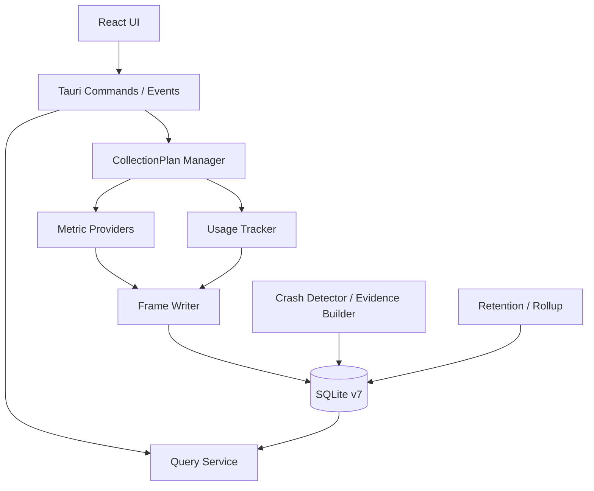

# 总体架构

## 技术栈结论

现有 Tauri 2 + Rust + React 18 + TypeScript + Vite + Tailwind + ECharts + Zustand 足以支持目标功能和接近 Codex 风格的精致桌面 UI。当前限制主要来自信息架构、组件规范、状态边界和数据接口，而不是框架能力，无需为了 UI 重写技术栈。

Rust 侧继续负责 Windows API、硬件 Provider、采集计划、SQLite、分层聚合和崩溃证据整理；React 侧只通过稳定的 Tauri command/event DTO 读取能力、设置、查询结果和进度。

## 模块边界

| 模块 | 责任 | 不应承担 |
| --- | --- | --- |
| Capability Registry | 探测 Provider、设备和指标能力 | 决定用户设置 |
| CollectionPlan Manager | 合并能力、设置、采样周期，管理启动/停止 | 直接写 SQL |
| Metric Provider | 读取一类来源并返回带质量信息的样本 | 做保留和聚合 |
| Usage Tracker | 记录前台切换和电脑状态区间 | 轮询所有进程资源 |
| Process Selector | 选择诊断价值高的进程并标注原因 | 保存所有历史前台应用 |
| Frame Writer | 将一次采样原子写入并重试 | 随意丢弃失败队列 |
| Query Service | 按时间范围查询、下采样、联表 | 暴露数据库内部结构给 UI |
| Crash Detector/Evidence Builder | 识别事件、锁定证据窗、生成可复核的统计摘要 | 生成原因判断、建议或严重度排行 |
| Maintenance | rollup、保留、checkpoint、空间统计 | 删除 retention hold 数据 |

## 运行时生命周期

1. 打开数据库，执行完整性检查和向前迁移。
2. 建立 `boot_session` 与 `collection_session`，读取用户配置。
3. 快速能力探测，生成 CollectionPlan；耗时探测可后台补充并增量更新计划。
4. 启动 Usage Tracker 和被启用的 Provider。
5. 每个系统采样帧以一个小事务写入；前台切换独立即时提交。
6. 后台分批执行 1 分钟/1 小时/每日 rollup、保留和 WAL checkpoint，避开启动和交互高峰。
7. 启动后异步扫描系统事件；发现崩溃时先建立 retention hold，再生成证据索引和客观摘要。
8. 正常退出时刷新队列、结束开放区间并记录 clean shutdown marker。

## 采样与背压

每个 Provider 有独立最小周期，不要求所有指标同频。均衡模式默认核心资源帧 2 秒、进程资源帧 5 秒；前台和电源状态变化即时写入，使用状态心跳 15–30 秒。Windows 节能模式下默认切换为核心 5 秒、进程 10 秒，并建立新的 collection session。慢传感器、静态信息和电池百分比遵循 [collection-policy.md](./collection-policy.md)，不随预设盲目加速。

若写入短暂失败，保留有界重试队列并指数退避；超过上限时记录 drop counter 和健康事件，不能静默清空。每个持久化样本保存实际时间和质量，不能用上一值填补睡眠、暂停、Provider 故障或调度长间隔。

## PR-01 存储骨架

PR-01 已把运行时写入边界接到 SQLite v7，但没有扩大 Provider、Tauri DTO 或 UI 范围：

- `Database` 持有串行写连接；查询使用独立只读连接，并设置 busy timeout。打开数据库时先完成 schema 迁移、开放 foreground 区间恢复，再创建新的 boot/collection session。
- `FrameWriter` 以 `ResourceSnapshot` 为队列单位。每个 frame 通过一个小事务写入 `sample_frame` 及已有的 system/process 子表；只有事务成功提交后才从队列移除。失败样本留在队首，重试次数和重试总数进入 `WriterHealth`，队列达到上限时只增加 drop count 并拒绝新样本。
- `WriterHealth` 暴露 queue depth、writer delay、drop count、retry count、队首重试次数、最近提交耗时、最近提交时间和最近错误。collector 在健康状态中继续同步已有的丢弃计数；完整诊断展示不属于本 PR。
- `rollup.rs` 只提供 rollup 表清单、待处理 frame 时间窗和维护状态接口。v7 DDL 已预留分钟、小时、日报和能耗表，但本 PR 不启动完整 rollup、保留清理或后台维护任务。
- v7 查询保留按进程名合并不同可执行版本的既有语义；历史字段仍按来源和 NULL 语义表达，不能通过查询层补成完整 coverage。

## API 与版本边界

Tauri DTO 应面向产品语义而非表结构，例如 `MetricCapability`、`CollectionSettings`、`TimelineSeries`、`UsageSummary`、`CrashEvidenceDetail`。每个证据摘要带 `processing_version` 和 coverage，每个采集会话保存有效指标、周期和 Provider，使历史数据始终可解释。

## UI 架构方向

保留现有前端栈，逐步补充：

- 设计 token：颜色、间距、圆角、字体层级、阴影、动效和图表色板。
- 一套 App Shell 与导航，一级视图为“时间线 / 使用统计 / 崩溃回溯 / 设置”。
- 查询状态统一处理 loading、empty、unsupported、disabled、error 和 stale。
- 图表只消费下采样后的视图模型，避免把大量原始点送到 React。
- UI bug 修复单独成 PR，避免与 v7 数据模型改造混在一起。
