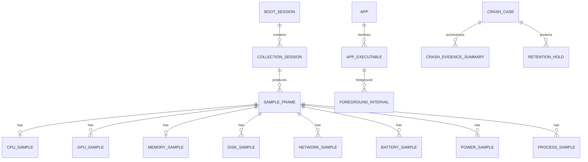

# SQLite schema v7 基线与 v8 GPU storage contract

## 原则

- 原始资源数据按类别使用宽表；新增指标通过可空列或新版本表演进。
- 小规模配置、能力和启用状态可使用 EAV；高频时序禁止使用通用 EAV。
- 静态容量、型号和 Provider 信息只在设备/会话层保存，不在每个采样点重复。
- “未启用”“不支持”“读取失败”“真实零值”具有不同语义。
- 所有时间统一存 UTC epoch milliseconds；展示时再转换本地时区。

## 实体关系

## 身份与采集元数据

| 表 | 关键字段 | 用途 |
| --- | --- | --- |
| `boot_session` | id, boot_id, boot_time, observed_start/end, shutdown_kind | 将样本和一次 Windows 启动/电源周期关联 |
| `collection_session` | id, boot_session_id, started/ended_at, app_version, schema_version, config_hash | 配置或能力变化时分段 |
| `hardware_device` | id, stable_key, category, vendor, model, capacity_bytes, first/last_seen | CPU/GPU/内存/磁盘静态信息 |
| `provider` | id, kind, name, version, priority, last_status | 记录实际数据来源 |
| `collection_session_metric` | session_id, device_id, metric_key, enabled, support_status, provider_id, interval_ms | 解释该会话为何有或没有某指标 |
| `app` | id, stable_key, process_name, display_name, publisher, category | 跨版本的逻辑应用；`process_name` 保存真实进程名，`display_name` 保留前台 resolver 提供的友好展示名 |
| `app_executable` | id, app_id, normalized_path, file_identity, version, package_family | 具体可执行文件身份 |
| `process_instance` | id, app_executable_id, pid, create/exit_ts, exit_code | 避免 PID 复用并支持运行时长/退出事件 |

`support_status` 至少支持 `supported`、`unsupported`、`permission_denied`、`provider_missing`、`probe_failed`。Provider 运行时失败写健康状态或样本 quality，不能篡改为 unsupported。

## 使用时间

| 表 | 关键字段 |
| --- | --- |
| `computer_state_interval` | boot_session_id, state, start_ts, end_ts, source, quality |
| `foreground_interval` | boot_session_id, app_executable_id, start_ts, end_ts, close_reason, context_id nullable |
| `window_context`（可选） | id, normalized_hash, protected_title, privacy_level |

`state` 为 `active`、`idle`、`locked`、`sleep`、`disconnected`、`unknown`。开放区间通过 `end_ts IS NULL` 表示，并在异常退出后的恢复阶段根据下一个可信事件封口。

## 原始资源时序

`sample_frame(id, collection_session_id, ts, sequence, duration_ms, writer_delay_ms)` 是一次系统采样的锚点。

| 表 | 主键/维度 | 代表字段 |
| --- | --- | --- |
| `cpu_sample` | frame_id | usage_pct, temp_c, package_power_w, effective_clock_mhz, quality_mask |
| `gpu_sample` | frame_id + device_id | usage_pct, memory_controller_usage_pct, temp_c, board_power_w, core_clock_mhz, memory_clock_mhz, vram_used_bytes, vram_total_bytes, power_scope, quality_mask |
| `memory_sample` | frame_id | used_bytes, available_bytes, usage_pct, quality_mask |
| `disk_sample` | frame_id + device_id | read_bps, write_bps, active_pct, temp_c, quality_mask |
| `network_sample` | frame_id + device_id | rx_bps, tx_bps, signal, rx/tx_phy_bps, quality_mask |
| `battery_sample` | frame_id + device_id | remaining_pct, charge_rate_w, state, quality_mask |
| `power_sample` | frame_id + device_id | power_w, energy_counter_wh, power_scope, quality_mask |
| `cooling_sample` | frame_id + device_id | rpm, sensor_kind, quality_mask |
| `process_sample` | frame_id + process_instance_id | cpu_pct, cpu_time_delta_us, working_set/private_bytes, gpu/vram, read/write/network rates, selection_reason, quality_mask |

类别关闭或能力探测不到设备时不生成对应类别行。单项关闭时列为 NULL，且 `collection_session_metric.enabled = false`；读取失败同样为 NULL，但 quality/status 指明失败。`selection_reason` 为位掩码：CPU Top-N、memory Top-N、I/O Top-N、foreground、watched、anomaly，可同时命中。

多 GPU/磁盘/网卡按 device_id 独立保存。GPU 利用率不相加；磁盘和物理网络总量由查询层派生，网络汇总默认排除 loopback 和重复虚拟接口。未探测到电池时不创建 battery row。

## PR-04A v8 GPU contract

v7 已有的 `gpu_sample` 表能够承载部分 GPU 指标，但不能无损表达 Spike-01B 目标集合。PR-04A 以 forward-only v7→v8 migration 补齐最小字段，不创建 NVIDIA 专用表：

| 产品 metric key | 存储列 | 单位/语义 |
| --- | --- | --- |
| `gpu.utilization_percent` | `usage_pct` | percent，按 device，合法零值为 `0` |
| `gpu.memory_controller_utilization_percent` | `memory_controller_usage_pct` | percent，按 device |
| `gpu.temperature_celsius` | `temp_c` | Celsius，按 device |
| `gpu.power_watts` | `board_power_w` + `power_scope` | W；scope 必须是 `gpu_board` |
| `gpu.graphics_clock_mhz` | `core_clock_mhz` | MHz，按 device |
| `gpu.memory_clock_mhz` | `memory_clock_mhz` | MHz，按 device |
| `gpu.vram_used_bytes` | `vram_used_bytes` | bytes，按 device |
| `gpu.vram_total_bytes` | `vram_total_bytes` | bytes，按 device，亦可作为 hardware capacity 的采集值 |

`NULL` 表示当前样本没有该 metric，不能被 writer 填成 `0`。合法零值保持为数值 `0`；`quality_mask` 是 provider-neutral 的质量位掩码，随样本写入并在 query DTO 中恢复。unsupported、disabled、failed 由 `collection_session_metric.enabled/support_status` 表达；provider/source 由 `provider`、`collection_session_metric.provider_id`、`collection_session`、`sample_frame` 和 `hardware_device` 联表追溯。PR-04A 只提供这条 historical traceability capability，生产 Provider 实际维护 metadata truth 属于 PR-04。`stable_key` 是不含 serial number 的 Provider runtime identity，不能使用长期数组 index 作为数据库身份。

`ResourceSnapshot.system.gpus` 是 0/1/multiple `GpuSample` 的 runtime DTO。FrameWriter 在写 `sample_frame`、baseline 子表和 GPU 子表时使用同一 SQLite transaction；失败回滚不会留下半个 frame。Query Service 提供嵌套在 `SystemSample` 中的多设备结果，并提供按时间范围和可选 `device_key` 的 GPU 查询；原始 GPU query 的 `maxPoints` 为 500..10000，按 device 独立限制返回点数并在 SQL 侧完成选择。`system_samples` 先选择 bounded frame 集合，再读取这些 frame 的 GPU rows。

当前 v8 不启动 GPU rollup worker。未来 rollup 必须按 device 计算利用率、温度、频率和 VRAM；不得把不同 GPU 的这些值错误相加。只有明确 scope 且时间范围不重叠的 board energy 才能在查询阶段派生合计。

功率样本必须保存 `power_scope`。CPU Package、独立 GPU Board、battery、wall/EMI 等范围不能混为同一“整机功耗”；只有明确不重叠的 CPU/GPU 项才允许形成组件合计。

适合复合时间主键且不依赖 rowid 的表应评估 `WITHOUT ROWID`。最终 DDL 需用真实数据基准测试后确定索引，至少覆盖时间范围查询、app 汇总和 crash evidence 查询，避免为每列建立索引。

## 聚合与分层压缩

- `system_rollup_1m`：按 minute/device/category 保存 avg/min/max/count 和 quality_count。
- `process_rollup_1m`：按 minute/app 保存加权 avg、max、CPU time、I/O totals、GPU active time、coverage 和命中原因。
- `process_rollup_1h`：按 hour/app 保存由分钟数据生成的长期趋势。
- `app_usage_daily`：按 local_date/app 保存 foreground_total_ms、active_usage_ms、idle_foreground_ms、launch_count。
- `app_resource_daily`：按 local_date/app 保存 CPU 计算量/贡献、内存峰值、GPU 活跃时长、I/O totals、crash/hang count 和 coverage。
- `energy_rollup_daily`：按 local_date/device/power_scope 保存 energy_wh、covered/expected duration、Provider 和构成。

详细进程样本只写 Top-N/前台/关注/异常集合；采集器可在内存中为所有可访问进程维护轻量累计值，并定期刷新应用日报，避免长期统计只覆盖曾进入 Top-N 的应用。GPU/网络归属若成本过高允许只覆盖选择集，但必须保存 coverage。

聚合表必须保存 processing_version、源时间范围、sample_count 和 coverage。avg 使用覆盖时间加权；max 可从下层 max 继续聚合；CPU time 与字节数直接相加。日界线以采集时区规则计算；跨午夜区间在聚合时切分，原始区间不拆碎。

## 系统事件与崩溃

| 表 | 用途 |
| --- | --- |
| `system_event` | 规范化 Windows Event Log 证据，保存 provider/event_id/record_id/time/payload 摘要 |
| `crash_case` | 一次候选系统崩溃，保存 anchor、事件分类依据、时间窗、证据状态和 processing_version |
| `retention_hold` | 保护一个 case 的原始时间范围，带到期/释放状态 |
| `crash_evidence_summary` | 指标、统计窗口、avg/min/max/delta、峰值时间、Top-N、coverage 和证据引用 |

`system_event` 对 `(channel, record_id)` 建唯一约束，启动扫描必须幂等。`crash_case` 也需要稳定去重键，重复启动不重复建案。schema 不保存 cause、recommendation、severity ranking 或自然语言诊断字段。

## 空间统计与删除

数据库占用应报告 main DB、`-wal` 和 `-shm` 总和。提供分开的清理动作：系统原始数据、进程详细/分钟/小时数据、使用统计、窗口上下文、崩溃案例；任何动作执行前列出会影响的 retention hold，默认不删除受保护数据。用户延长已被压缩或删除的数据层时，历史细节不可恢复。
