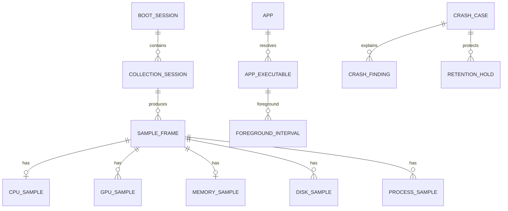

# SQLite schema v7 设计

## 原则

- 原始资源数据按类别使用宽表；新增指标通过可空列或新版本表演进。
- 小规模配置、能力和启用状态可使用 EAV；高频时序禁止使用通用 EAV。
- 静态容量、型号和 Provider 信息只在设备/会话层保存，不在每个采样点重复。
- “未启用”“不支持”“读取失败”“真实零值”具有不同语义。
- 所有时间统一存 UTC epoch milliseconds；展示时再转换本地时区。

## 实体关系

## 身份与采集元数据

| 表 | 关键字段 | 用途 |
| --- | --- | --- |
| `boot_session` | id, boot_id, boot_time, observed_start/end, clean_shutdown | 将样本和一次 Windows 启动关联 |
| `collection_session` | id, boot_session_id, started/ended_at, app_version, schema_version, config_hash | 配置或能力变化时分段 |
| `hardware_device` | id, stable_key, category, vendor, model, capacity_bytes, first/last_seen | CPU/GPU/内存/磁盘静态信息 |
| `provider` | id, kind, name, version, priority, last_status | 记录实际数据来源 |
| `collection_session_metric` | session_id, device_id, metric_key, enabled, support_status, provider_id, interval_ms | 解释该会话为何有或没有某指标 |
| `app` | id, stable_key, display_name, publisher, category | 跨版本的逻辑应用 |
| `app_executable` | id, app_id, normalized_path, file_identity, version, package_family | 具体可执行文件身份 |

`support_status` 至少支持 `supported`、`unsupported`、`permission_denied`、`provider_missing`、`probe_failed`。Provider 运行时失败写健康状态或样本 quality，不能篡改为 unsupported。

## 使用时间

| 表 | 关键字段 |
| --- | --- |
| `computer_state_interval` | boot_session_id, state, start_ts, end_ts, source, quality |
| `foreground_interval` | boot_session_id, app_executable_id, start_ts, end_ts, close_reason, context_id nullable |
| `window_context`（可选） | id, normalized_hash, protected_title, privacy_level |

`state` 为 `active`、`idle`、`locked`、`sleep`、`disconnected`、`unknown`。开放区间通过 `end_ts IS NULL` 表示，并在异常退出后的恢复阶段根据下一个可信事件封口。

## 原始资源时序

`sample_frame(id, collection_session_id, ts, sequence, duration_ms, writer_delay_ms)` 是一次系统采样的锚点。

| 表 | 主键/维度 | 代表字段 |
| --- | --- | --- |
| `cpu_sample` | frame_id | usage_pct, temp_c, package_power_w, effective_clock_mhz, quality_mask |
| `gpu_sample` | frame_id + device_id | usage_pct, temp_c, board_power_w, core_clock_mhz, vram_used_bytes, quality_mask |
| `memory_sample` | frame_id | used_bytes, available_bytes, usage_pct, quality_mask |
| `disk_sample` | frame_id + device_id | read_bps, write_bps, active_pct, quality_mask |
| `process_sample` | frame_id + app_executable_id/process_instance | pid, cpu_pct, working_set_bytes, read_bps, write_bps, selection_reason, quality_mask |

类别关闭时不生成对应类别行。单项关闭时列为 NULL，且 `collection_session_metric.enabled = false`；读取失败同样为 NULL，但 quality/status 指明失败。`selection_reason` 为位掩码：CPU Top-N、memory Top-N、I/O Top-N、foreground、watched、anomaly，可同时命中。

适合复合时间主键且不依赖 rowid 的表应评估 `WITHOUT ROWID`。最终 DDL 需用真实数据基准测试后确定索引，至少覆盖时间范围查询、app 汇总和 crash evidence 查询，避免为每列建立索引。

## 聚合表

- `system_rollup_1m`：按 minute/device/category 保存 avg/min/max/count 和 quality_count。
- `process_rollup_1m`：按 minute/app 保存 CPU、内存和 I/O 聚合，以及命中原因。
- `app_usage_daily`：按 local_date/app 保存 foreground_total_ms、active_usage_ms、idle_foreground_ms、launch_count。

聚合表可重建，必须保存 rollup 算法版本和源时间范围。日界线以采集时区规则计算；跨午夜区间在聚合时切分，原始区间不拆碎。

## 系统事件与崩溃

| 表 | 用途 |
| --- | --- |
| `system_event` | 规范化 Windows Event Log 证据，保存 provider/event_id/record_id/time/payload 摘要 |
| `crash_case` | 一次候选崩溃，保存类型、置信度、时间窗、状态和 analysis_version |
| `retention_hold` | 保护一个 case 的原始时间范围，带到期/释放状态 |
| `crash_finding` | 规则 id、严重度、观察值、基线、证据引用、解释和限制 |

`system_event` 对 `(channel, record_id)` 建唯一约束，启动扫描必须幂等。`crash_case` 也需要稳定去重键，重复启动不重复建案。

## 空间统计与删除

数据库占用应报告 main DB、`-wal` 和 `-shm` 总和。提供分开的清理动作：资源历史、进程快照、使用统计、窗口上下文、崩溃案例；任何动作执行前列出会影响的 retention hold，默认不删除受保护数据。
